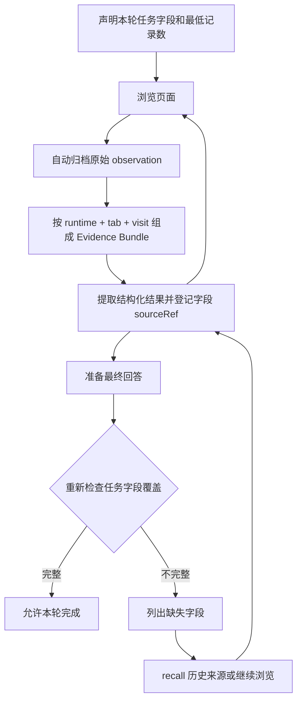

# 页面证据与完成检查

我们将浏览器状态、历史证据和任务覆盖分开管理。旧页面没有登记任务字段，不会成为下一次点击、滚动或导航的失败原因；完成检查只针对本轮声明的任务契约。



我们不把图中流程当作逐页闸门：Agent 可先连续浏览，再从归档集中提取或登记。审批、取消、失效元素引用与真实动作失败检查仍然有效。

## 四层数据

| 数据 | 保存什么 | 身份与边界 |
| --- | --- | --- |
| Observation | 完整页面表示、时间、来源 URL、有界脚本提取结果 | 同一 Session 原始事件日志中的一次采集；不是实时网页 |
| Evidence Bundle | 一次页面访问下的 observation 引用集合 | runtimeId + tabId + visitId；不拼接 DOM、不删除旧版本 |
| Task record | 业务记录 ID，每个字段的 sourceRef | 模型提供字段映射，Host 从来源解析值与 URL/时间 |
| Task coverage | 本轮声明字段、最低记录数、缺失列表 | 逐条登记记录检查；不等于网站遍历完整性 |

主框架导航（包括相同 URL 重载、SPA 历史跳转）产生新 visit；没有导航的点击、滚动、重新观察及 DOM full 基准更新不拆分访问。切回未导航的标签页继续原 Bundle。旧日志没有 visitId 时，按导航工具和 URL 做兼容分组，不能完全复原所有历史 SPA 访问。

## 具体调用示例

先声明用户所需输出。契约在本轮固定，禁止为通过检查而改成 interaction 或删字段；用户新一轮可以声明新任务。

```json
{"mode":"records","objective":"整理至少一个岗位及其公司和发布日期","requiredFields":["title","company","publishedAt"],"minRecords":1}
```

这是 `browser_define_task` 的参数。纯点击或导航任务才使用 `mode: "interaction"`，它不要求结构化记录，也不证明动作达到用户目标。

浏览后，`browser_execute_script` 从页面返回对象数组。例如实际提取结果为：

```json
[{"title":"工程师","company":"示例公司","publishedAt":"2026-09-13"}]
```

通过 `browser_recall({"observationId":"实际观察ID"})` 获取 Host 生成的 `sourceRecords[].fields[].sourceRef`，原样复制引用到 `browser_record_facts`：

```json
{"records":[{"recordId":"job-1","fields":[{"name":"title","sourceRef":{"observationId":"实际观察ID","recordId":"回读获得的来源记录ID","field":"/title"}}]}]}
```

以上 ID 是说明占位符，不能直接运行。模型不再提交重抄的 value/evidence。Host 解析值，并绑定归档来源；引用不存在时整批拒绝。也可使用 `{observationId,start,end}` 引用原始 fullOutput 中的绝对字符区间 `[start,end)`，以 JavaScript UTF-16 字符偏移计数。它不自动去掉 HTML 或理解字段含义。

纯文本引用可调用 `browser_recall({observationId, query: "页面原文"})`，直接复制 `sourceSpans[].sourceRef`，无需手算偏移。此处 query 是区分大小写的精确匹配，须包含非空白字符且最多 1200 个 UTF-16 字符；从 offset 起返回最多 10 个不重叠匹配。`nextMatchOffset` 非空时将其作为下一次 offset 继续查询；它与文本窗口的 `nextOffset`、结构化记录的 `nextRecordOffset` 分别分页。重复文本需要检查上下文确认实体。不存在的文字返回空列表，不会生成引用。DOM 的 `[N]` 编号不是字符偏移，也不是来源记录 ID；空区间、越界区间和混用两种引用格式仍被拒绝。

如果只登记 title，`browser_check_coverage` 返回 `partial`，列出 job-1 缺 company、publishedAt。此时继续打开其他页面仍被允许；随后可回读旧 observation，用同一个业务 recordId 补充两字段。换页、上下文压缩和关闭浏览器不删除原 Session 的来源。

### 已有原文时直接登记

`browser_record_facts` 的字段也接受 `sourceRef: {observationId, query: "唯一的页面原文"}`，可一次提交多字段/多记录，不必每字段先 recall。Host 在同一条归档中精确查找并保存标准的 start/end 引用。无匹配、有多个匹配、空白或超过 1200 字符都会拒绝；重复值应加入实体上下文，或用 recall 取得精确区间。query 不可与 start/end 或 recordId/field 混用，也不会自动修正或编造值。整批校验仍是原子操作。

## 完成阶段的实际行为

若缺少证据且工具已报告网站访问受限，我们将完成状态结束为访问失败，不再要求从不可访问页面反复恢复。累计三次受限结果会停止该轮，避免在阻断页上空转。已有完整记录时仍可提交答案，语义正确性在评测中由独立 LLM Judge 核实。

`agent/turn-stopping` 每次重新计算覆盖，不信任之前某次通过的结果。缺任务声明或缺字段时注入恢复提示，使同一轮继续。连续三次相同缺口或累计八次恢复仍未补齐，会显式结束为错误，而不是循环到假完成。取消信号优先，插件卸载移除监听。

当前 DSH 在触发该 hook 前可能已输出助手文字，因此这不是“最终答案在展示前审核”的闸门，而是**轮次完成状态检查**。界面可能看到未被接受的提前回答。若要完全阻止未通过的最终文字展示，需要宿主增加提交前缓冲或独立的结构化完成协议。

## 能保证与不能保证

- 检查每条已登记记录的必填字段，拒绝缺失、null、空字符串；0 和 false 是有效值。记录数只按业务 recordId 计数，不能证明对应不同真实实体。
- sourceRef 能追溯到归档值，不证明脚本真的从网页读取了该值、不验证字段映射语义，也不保证网站数据真实或仍然有效。不能用评分人数替代评论数，也不能把不同实体的字段拼成一条记录。
- requiredFields/minRecords 仍由模型依据用户需求声明，代码不能自动证明声明忠实于用户要求；interaction 模式不是语义验收器。
- 不检查自由文本答案中的所有断言、不自动核实日期范围、不证明页面或服务器条目已找全。此类需求还需专门的任务约束和校验器。
- 来源索引最多取前 100 条、每条 100 个标量字段、深度 8、单字符串 12000 字符；结构化归档还受脚本输出裁剪和 64000 字符上限约束。被裁剪结果不建立结构化引用，需缩小提取范围。回读返回索引范围提示，不将有界预览当作完整数据。
- 旧 `observations/facts/evidence` 写入保持兼容，但不自动算作新任务字段覆盖。空参数写入返回错误并引导使用 recall，不再兼作查询。

我们分层验证：`npm test` 检查引用/分组/重放/覆盖；`npm run test:host` 用真实 DSH Loop 与 Chromium 验证跨页不中断、缺字段恢复、最终状态与工具协议；`npm run test:smoke` 检查浏览器动作；WebVoyager 全量运行则记录真实模型与网站结果。受控适配器测试不等于真实模型或真实网站成功率。
